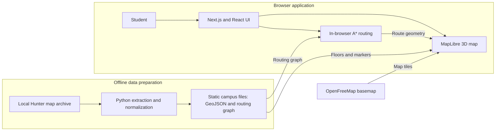

# Hunter Spatial

Indoor wayfinding for CUNY Hunter College (68th Street). Students pick a building and floor, search a room code, and see the extruded floor plan in MapLibre.

See [plan.md](plan.md) for architecture and milestones. Geometry comes from a one-time HAR extract ([data/SOURCE.md](data/SOURCE.md)).

## System Architecture

Campus geometry is prepared offline and shipped as static files. The browser renders the map and calculates routes locally, so the deployed app does not need a map backend or database.



## Tech Stack

| Category | Core Technology | Role in Hunter Spatial |
|:---|:---|:---|
| **Web & UI** | Next.js 15, React 19, TypeScript 5, Tailwind CSS v4 | Application shell, reactive floor state, search autocomplete, responsive drawers |
| **3D Geospatial** | MapLibre GL JS v6 (WebGL2), OpenFreeMap | GPU-accelerated 3D campus masses, extruded indoor room plans, and route ribbons |
| **Routing Engine** | `ngraph.graph`, `ngraph.path` (A* Algorithm) | Sub-3ms in-browser 3D shortest pathfinding, multi-floor routing, and ADA filter |
| **Data Pipeline** | Python 3, GeoJSON (WGS84) | Offline HAR extraction, geometry cleanup, 3D room boundaries, and graph generation |
| **Testing Suite** | Vitest, Python `unittest` | Unit and integration testing across frontend logic and geospatial pipelines |

> 📖 **Full Architectural Reference:** See [**stack.md**](stack.md) for in-depth descriptions of each tool, algorithm details, data formats, and design decisions (such as MapLibre GL JS vs. Three.js).

## Run

```bash
cd apps/web
npm install
npm run dev
```

Open [http://localhost:3000](http://localhost:3000). Search `N304` or pick a building and floor.

```bash
python scripts/extract_har.py          # HAR -> data/raw/ (gitignored)
python scripts/convert_to_geojson.py   # -> apps/web/public/data/hunter-floors.geojson
npm test                               # from apps/web
```

## Folders

- [plan.md](plan.md) — stages, milestones, and data rules
- [stack.md](stack.md) — full technical stack, algorithms, data formats, and testing reference
- `apps/web` — the Next.js web application
- `scripts/` — data extraction, geometry conversion, and routing graph scripts
- `data/` — local HAR only (gitignored); do not commit `.har` or `data/raw/`
