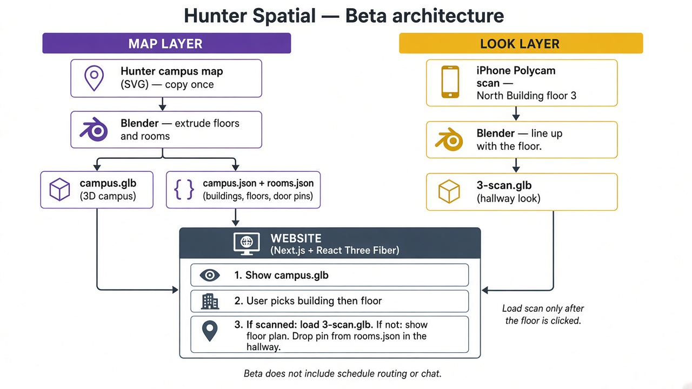

# Hunter Spatial — project plan

An interactive 3D map of CUNY Hunter College (68th Street). Students look around campus, find rooms, and later get walked to class.

**Look and feel:** [Jane Street’s office page](https://www.janestreet.com/culture/our-offices/?office=nyc) (click around a 3D building).  
**Floor and room data:** [Hunter’s 68th Street map](https://www.hunter.cuny.edu/about/campus-information/68th-street-campus/map/) (buildings, floors, room numbers).

This is **not** Google Maps outdoors. It is campus buildings, floors, and hallways.

---

## Two layers (do not mix them)

| Layer | What it is | Where it lives |
|--------|------------|----------------|
| **Map** | Building shapes, floors, hallways, room pins | Blender model + `data/campus.json` + `data/rooms.json` |
| **Look** | What a real hallway looks like | A Polycam scan, one file per scanned floor |

Pick a building, pick a floor. If that floor was scanned, load the scan. If not, show the 3D floor plan. A pin sits in the hallway **outside** the classroom door, not inside the room.

The chat and the class schedule both say a **room code** (like `N304`). The 3D view already knows where that pin is. They do not invent 3D coordinates on their own.

---

## Schedule

### 1. Beta (now)

Beta is how the pieces connect: Hunter’s map becomes the 3D campus and room pins; a Polycam walk becomes the hallway look; the website loads the scan only after you pick that floor.

**Real map:** Copy Hunter’s campus map **once** (the SVG/canvas with buildings, floors, and rooms). Put it in Blender. Raise the walls about one story (~3 meters). Export a 3D campus. Rewrite `campus.json` and `rooms.json` from those real rooms. Then you can delete the OpenStreetMap dummy outlines in `data/extract/`.

Copy the map into the project. Do **not** scrape Hunter’s website every time someone opens our site.

**Real hallway look:** Scan 1–2 floors of North Building with Polycam on an iPhone. Put the file here:

`assets/glb/floors/N/3-scan.glb`

Line it up with the North Building floor in Blender so the pin sits in the real hallway.

**Done when:** A laptop and a normal phone can open campus, enter a scanned floor, and see a pin like `N304` in the right hallway.

### 2. Deployment V1

If Beta works, cover the other 68th Street buildings the same way.

- Scans only where you actually walked with Polycam. Other floors stay as floor plans.
- Big 3D files load **only when the user opens that floor** (important for phones).
- Store those files as files (later a file host). Not a database of 3D blobs.

### 3. Final deployment — class schedule

Student uploads a CUNY calendar file (`.ics`), or types a room like `N608`. The app walks them to class.

Use **A\*** on a simple path of hallway points: corridor corners, stairs, elevators, door pins. Those points are placed on the map. They are **not** the thousands of points inside a Polycam mesh.

Do **not** log into CUNYFirst from this app.

### 4. Extended — questions about Hunter

A chat that reads Hunter’s official pages (saved on a schedule, not live on every question).

Example: “Where do I get a OneCard?” → a short answer + room code → the same pin and camera move as searching `N304`.

Stack for this later: FastAPI + Chroma (search the text). Next.js still draws the campus.

---

## What is already in this repo

A **dummy** campus so the website can run before Beta assets exist:

- Building outlines from OpenStreetMap (outside shape of the buildings only)
- A fake North Building hallway (not a real Polycam scan)
- Room names from Hunter’s public list, but **pin positions are guessed** along a fake hallway

That dummy is a stand-in. Beta is still the Hunter map + a real scan.

**Keep (real app):** `apps/web`, `data/campus.json`, `data/rooms.json`, `scripts/`  
**Replace:** `assets/glb/campus.glb`, `assets/glb/floors/N/3-scan.glb`, guessed pins in `rooms.json`  
**Copies (do not edit, Git ignores them):** `apps/web/src/data/*.json`, `apps/web/public/models/` — rebuilt by `npm run dev`

---

## Next concrete step

1. Save Hunter’s map into the project and build the real campus in Blender.  
2. Scan North Building floor 3 with Polycam and replace `assets/glb/floors/N/3-scan.glb`.  
3. Move pins in `data/rooms.json` to the real doors.  
4. Then delete `data/extract/` if you no longer need the OpenStreetMap backup.
